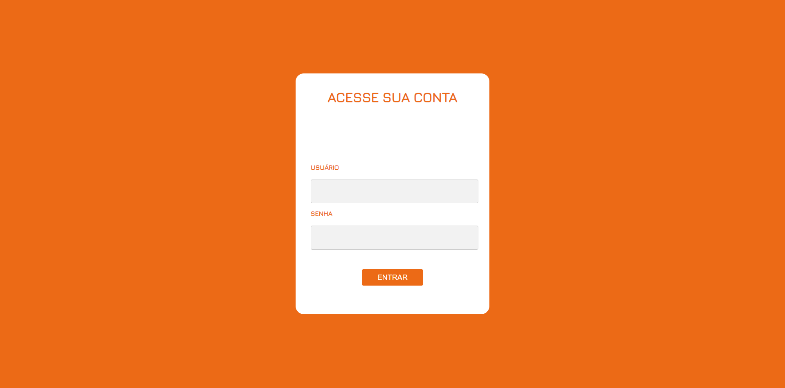
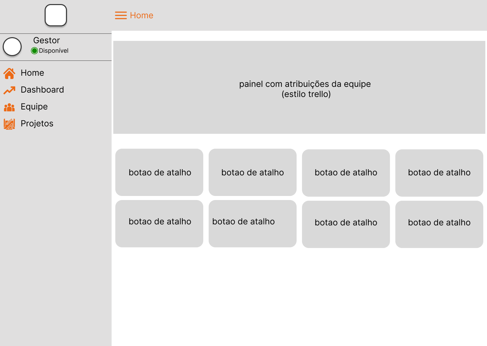
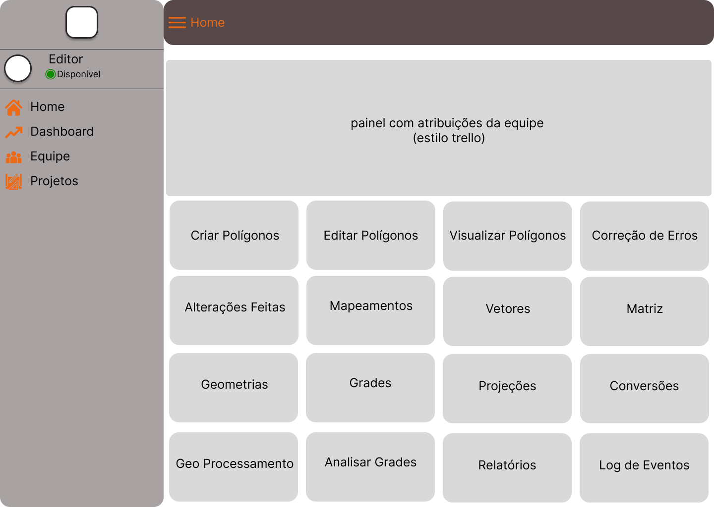
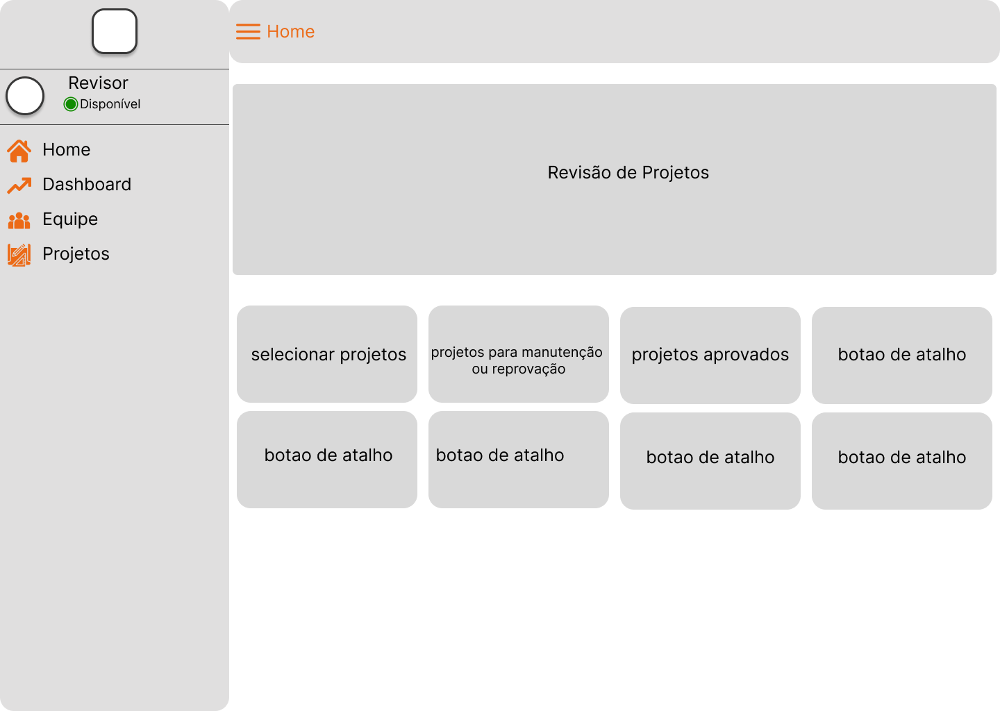
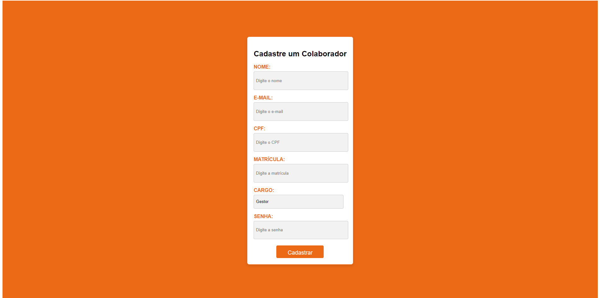

  

<h1  align="center">Sprint 1: 25/03/2024 a 18/04/2024</h1>

<a  href="#objetivos">Objetivos da sprint</a> &nbsp |&nbsp &nbsp
<a  href="#entregas">Entregas</a> &nbsp |&nbsp &nbsp
<a  href="#sprint_backlog">Sprint Backlog 1</a> &nbsp |&nbsp &nbsp
<a  href="#wireframe">Wireframe</a> &nbsp |&nbsp &nbsp
<a  href="#kanban">KanBan</a> &nbsp |&nbsp &nbsp 
<a  href="#metricas">Métricas do time</a> &nbsp |&nbsp &nbsp 
<a  href="#sprint_retrospectiva">Sprint Retrospectiva</a>

<a href="">Voltar para Documentação<a>
 

  

 
  
:movie_camera: Vídeo sobre a 1ª sprint <a href="https://youtu.be/G6foH98PoDM">***aqui***</a>  

 

Para início do desenvolvimento de um site para ** plataforma educacional sobre o Scrum **, durante esta primeira sprint, nossa equipe concentrou seus esforços na criação do Wireframe, que servirá como base para o layout e a estrutura do site.

   

## :dart: Objetivos da Sprint

Os requisitos definidos pela equipe abrangidos por essa sprint são:

  

- :heavy_check_mark: **1:** Definição de cargos e responsabilidades da equipe;

- :heavy_check_mark: **2:** Desenvolvimento da identidade visual da empresa;

- :heavy_check_mark: **3:** Definição e criação do layout (Wireframe);

- :heavy_check_mark: **4:** Aplicar WireFrame no código (front-end);

- :heavy_check_mark: **5:** Modelagem do Banco de Dados fornecido;

- :heavy_check_mark: **6:** Elaboração da Documentação e organização no GitHub

- :heavy_check_mark: **7:** Apresentação

 

## 📲 Entregas

Para entregas da sprint, tivemos os artefatos SCRUM validados, como Backlog do Produto, Backlog da Sprint 01, através de comunicação direta entre o P.O. e o cliente. 

Para atender uma necessidade do cliente, foi criado de forma parcial o front-end do produto. Aplicando também outras duas necessidades requisitadas
pelo cliente: cadastro de usuários e consulta de performance da equipe.
  

### 1: Definição de cargos e responsabilidades da equipe

  

Definição dos cargos de PO (Product Owner) e Scrum Master, assim como definição dos desenvolvedores.

  

### 2: Desenvolvimento da identidade visual da empresa

  

Criação do nome, logo e slogan da equipe, redes sociais e GitHub.

  

### 3: Definição e criação do layout (Wireframe)

  

Estabelecimento da estrutura do software e desenvolvimento do wireframe.

### 4: Aplicar WireFrame no código (front-end)

  

Aplicação de uma prototipação de forma prática
e que será usada na entrega final do produto.

### 5: Modelagem do Banco de Dados fornecido

Análise de banco de dados fornecido pelo cliente, tendo em vista
avaliar a necessidade do relacionamento de tabelas

### 6: Elaboração da documentação e organização no GitHUB

  

Criação da documentação e organização visual no GitHub para facilitar o gerenciamento e compartilhamento de informações.

### 7: Apresentação

  

Apresentação para o cliente (Sprint Review)

→ [Voltar ao topo](#topo)

  

## :clipboard: Sprint Backlog 1

A Sprint Planning foi realizada no dia 05/09/2023, gerou os artefatos para o backlog abaixo:

      
       

→ [Voltar ao topo](#topo)

 

## :rice_scene: Wireframe

      
       
      
       
      
       
      
       
      

→ [Voltar ao topo](#topo)

 

##  :bar_chart: Trello

      
       

→ [Voltar ao topo](#topo)

 

## :chart_with_upwards_trend: Métricas do time

Nesta sprint o time se uniu para as entregas de cada item listado na backlog da sprint.

- Abaixo se encontra o gráfico Burndown gerado pela equipe nesta sprint, onde o eixo X são os dias trabalhados e o eixo Y representa as entregas de cada dia:

  → Para ter acesso a planilha com os dados e gráfico <a href="https://fatecspgov-my.sharepoint.com/:x:/g/personal/gustavo_carvalho21_fatec_sp_gov_br/EYHhekfCCWVGjcrbAh9dUcMBErhKBofVpfHzoNdkV9C2jg?e=kDRqlZ&nav=MTVfezAwMDAwMDAwLTAwMDEtMDAwMC0wMDAwLTAwMDAwMDAwMDAwMH0">clique aqui!</a>

→ [Voltar ao topo](#topo)

 

## :bulb: Sprint Retrospectiva

- ### O que funcionou bem?
  - Divisão de tarefas e realização das mesmas;
  - Realização das tarefas dentro do prazo estipulado;
  - Criação e organização da documentação no GitHub.
  
- ### O que pode melhorar?
  - A equipe teve dificuldades para a utilização do GitHub, procuraremos buscar mais conhecimento sobre a ferramenta;
  - Dificuldades em realizar as daily's; 
  - Não realizamos a documentação do User Stories.

→ [Voltar ao topo](#topo)
